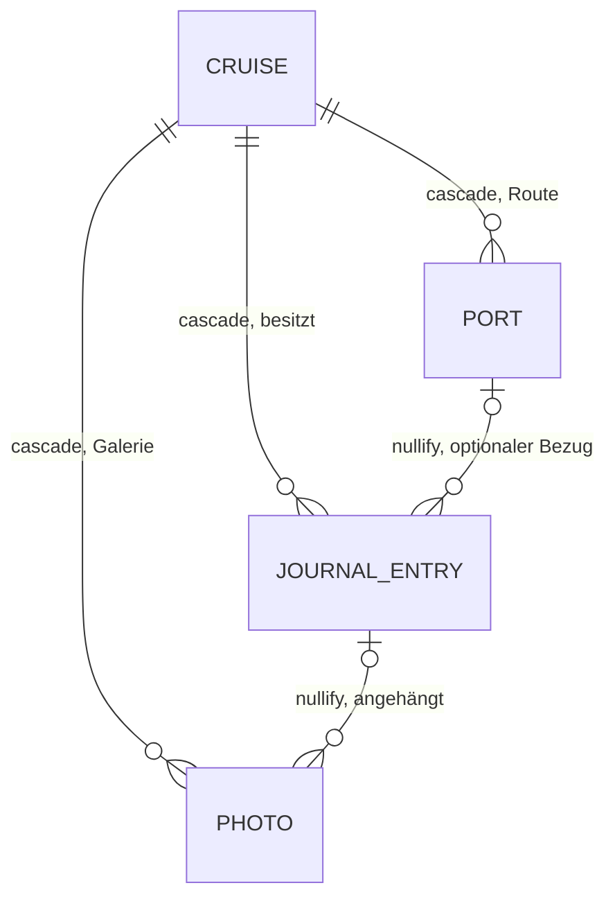

# Contract — Journal-Editor („Erinnerung zuerst, Eckdaten als Zweitschritt")

**Status:** Verbindlich für Run 1.8.5, Wellen T5 (Design), T7 (Modell) und
T8 (UI) — Stand 2026-08-27, gehört zu
[ADR-003](../../adr/ADR-003-journal-kern.md).
Diese Datei ist die Naht: Designer (T5) und Modell-Dev (T7) bauen unabhängig
gegen diesen Contract, nicht gegeneinander. Änderungen gehen über Winston,
nicht still per Diff.

Rev. 2026-08-27/2 (über Winston, nach Codex-Gate #4): `entryDate` auf
Date-only-Semantik umgestellt (Finding 3) und LWW-Mutations-Matrix als J2a
ergänzt (Finding 2); Details im Zeitzonen- bzw. LWW-Vertrag von ADR-003.

Rev. 2026-08-27/3 (über Winston, Andre-Entscheid „neue Richtung"): J3
(separater Tagebuch-Strang) verworfen und durch J3neu ersetzt —
Journal-Einträge werden in den bestehenden Route-Abschnitt der
`CruiseDetailView` integriert, inkl. Klapp-Zustandsmaschine für aktive
Reisen. J1/J2/J2a/J4/J5 unverändert. Siehe Nachtrag in ADR-003.

---

## J1 — Datenmodell-Naht (verbindliche Namen, Typen, Defaults)

T7 implementiert exakt diese Felder; T5/T8 dürfen sich auf die Namen verlassen.
Alle Regeln CloudKit-konform nach ADR-002 §3 (Defaults, optionale
Relationships, keine `.unique`; Dedup über stabile `id: UUID`).

### Neues Modell `JournalEntry`

| Feld | Typ | Default | Bedeutung |
|---|---|---|---|
| `id` | `UUID` | `UUID()` | Stabile App-ID, kein Unique-Constraint (ADR-002 §4) |
| `text` | `String` | `""` | Die Erinnerung (Freitext, mehrzeilig) |
| `entryDate` | `Date` | `Date()` (reiner Schema-Default, CloudKit-Pflicht — nie unnormalisiert persistieren) | Kalendertag als **Date-only-Wert**: **jeder Schreibpfad** (Editor-Save, Import/T7b) persistiert **12:00 UTC** des Tag-Tripels — importierte Werte werden auf 12:00 UTC ihres UTC-Tag-Tripels normalisiert. Tag-Extraktion nur über UTC-Kalender; Vergleiche auf Tag-Tripeln (Jahr/Monat/Tag, s. J2), nie `==`, nie lokales `startOfDay` |
| `moodRaw` | `String` | `""` | Stimmung als stabiler Roh-String (s. J4); `""` = keine Stimmung |
| `createdAt` | `Date` | `Date()` | Erstellungsdatum |
| `updatedAt` | `Date` | `Date()` | Last-Writer-Wins, bei jedem Save bumpen (ADR-002 §2) |
| `cruise` | `Cruise?` | — | Zugehörige Reise (inverse Seite) |
| `port` | `Port?` | — | Optionaler Hafen-Bezug (inverse Seite) |
| `photosStorage` | `[Photo]?` | — | `@Relationship(deleteRule: .nullify, inverse: \Photo.journalEntry)`; computed Wrapper `photos: [Photo]` nach Cruise-Muster |

Abgeleitet, **nicht** gespeichert: Reisetag-Nummer („Tag 3") =
Kalendertag-Differenz der **Tag-Tripel** (Zeitzonen-Vertrag: `entryDate`
via UTC-Kalender, `cruise.startDate` via Geräte-Kalender) + 1 — nie rohe
`Date`-Differenz (UI-berechnet, kein Drift-Risiko).
Kein `isDemo` auf `JournalEntry` — Demo-Filterung läuft wie bei
Port/Expense/Photo über `cruise?.isDemo`.

### Erweiterungen bestehender Modelle (alle additiv)

| Modell | Neues Feld | Typ/Default | Regel |
|---|---|---|---|
| `Photo` | `caption` | `String = ""` | Bildunterschrift, optional befüllbar |
| `Photo` | `journalEntry` | `JournalEntry?` | Inverse zu `JournalEntry.photosStorage`; Foto bleibt zusätzlich `cruise`-Kind (Galerie + Aggregate unverändert) |
| `Cruise` | `journalEntriesStorage` | `[JournalEntry]?` | `@Relationship(deleteRule: .cascade, inverse: \JournalEntry.cruise)` + computed `journalEntries: [JournalEntry]` nach bestehendem Storage-Muster |
| `Port` | `journalEntriesStorage` | `[JournalEntry]?` | `@Relationship(deleteRule: .nullify, inverse: \JournalEntry.port)`; kein computed Wrapper nötig (kein UI-Bedarf) |

Löschregeln: Reise löschen → Einträge weg (cascade). Eintrag löschen →
Fotos bleiben in der Reise-Galerie (`journalEntry` wird genullt). Hafen
löschen → Eintrag bleibt, `port` wird genullt.

---

## J2 — Editor-Flow (Reihenfolge ist der Vertrag, Darstellung ist Design)

Zwei Schritte, feste Reihenfolge. Ob als zwei Screens, ein Scroll-Flow oder
Sheet mit Fortschritt, entscheidet T5 — die Priorität „Erinnerung prominent
zuerst, Eckdaten nachgelagert" ist verbindlich.

**Schritt 1 „Erinnerung"** (Einstieg, keine Pflicht-Metadaten davor):

| Feld | Eingabe | Regel |
|---|---|---|
| Text | mehrzeiliger Texteditor | Pflichtregel: Weiter/Speichern erst, wenn Text nicht leer **oder** ≥ 1 Foto gewählt |
| Fotos | Foto-Picker, 0–n | Neue Fotos werden beim Save als `Photo` mit `cruise` = Reise **und** `journalEntry` = Eintrag angelegt; `sortOrder` ans Ende der bestehenden Galerie |
| Caption je Foto | einzeilig, optional | Default `""`; Eingabe direkt am Foto-Thumbnail |

**Schritt 2 „Eckdaten"** (alles vorbelegt, User kann durchwinken):

| Feld | Eingabe | Default-Regel |
|---|---|---|
| Tag/Datum | Datums-Auswahl, begrenzt auf `[cruise.startDate, cruise.endDate]` | Heute (Tag-Tripel im Geräte-Kalender), geklemmt auf den Reisezeitraum (vor der Reise → Starttag, danach → Endtag); Klemmen und Grenzen als Tag-Tripel-Vergleich nach Zeitzonen-Vertrag (ADR-003), persistiert als 12:00 UTC des gewählten Tags |
| Hafen-Bezug | Auswahl über `cruise.route` (nach `sortOrder`, inkl. Seetage) + Option „Kein Hafen" | Erster Route-Stopp, dessen `arrival` auf dem gewählten Tag liegt (Tag-Tripel: `arrival` via Geräte-Kalender, Eintragstag via UTC-Kalender); sonst kein Hafen. Bei Datumswechsel neu berechnet, solange der User nicht manuell gewählt hat |
| Stimmung | 5 Optionen + „keine" (s. J4) | Keine Stimmung (`moodRaw == ""`) |

**Save-Semantik:** Speichern erst am Ende von Schritt 2 (ein Insert, kein
Zwischenspeichern); Abbrechen verwirft Eintrag und noch nicht gespeicherte
Fotos. Alle Timestamp-Bumps folgen der Matrix J2a.

**Bearbeiten:** gleicher Editor, alle Felder vorbelegt, gleiche Reihenfolge.
**Löschen:** aus der Eintrags-Detailansicht (J3neu (c)); löscht nur den
Eintrag (Fotos bleiben); Bumps nach J2a.

### J2a — LWW-Mutations-Matrix (verbindlich, T7-Tests decken jede Zeile ab)

Konfliktregel: LWW pro Objekt über `updatedAt` (ADR-002 §2, ADR-003
LWW-Vertrag). `createdAt` wird einmal beim Insert gesetzt und danach **nie**
verändert. SwiftData-Nullify bumpt nichts automatisch — die Lösch-Pfade
führen die markierten Bumps explizit aus.

| Mutation | `entry.createdAt` | `entry.updatedAt` | `photo.updatedAt` |
|---|---|---|---|
| Eintrag anlegen (Save Schritt 2) | = now, danach unveränderlich | = `createdAt` | neue Fotos: gesetzt beim Anlegen |
| `text` / `entryDate` / `moodRaw` ändern | — | bump | — |
| Hafen setzen / wechseln / entfernen (Editor) | — | bump | — |
| Foto anhängen (neu oder bestehend) | — | bump | bump (Link `journalEntry` geändert) |
| Foto abhängen (Detach im Editor) | — | bump | bump |
| Caption ändern | — | — | bump |
| Foto aus Galerie löschen (Photo entfällt, hing an Eintrag) | — | bump, explizit im Lösch-Pfad | (Objekt entfällt) |
| Eintrag löschen → Nullify `photo.journalEntry` | (Objekt entfällt) | (Objekt entfällt) | bump je betroffenem Foto, explizit im Lösch-Pfad |
| Hafen löschen → Nullify `entry.port` | — | bump, explizit im Lösch-Pfad | — |
| Reise löschen (Cascade) | (Objekt entfällt) | (Objekt entfällt) | (Fotos entfallen mit) |

---

## J3neu — Route-Integration (ersetzt J3; Lesansicht im Route-Abschnitt der `CruiseDetailView`)

Der separate Tagebuch-Strang (altes J3, Logbuch-Strang-Design) ist
verworfen (Andre-Entscheid 2026-08-27). Journal-Einträge erscheinen im
bestehenden Route-Abschnitt: **ein Tagesfaden** aus Route-Stopps (inkl.
Seetage), keine zweite parallele Tages-Liste. Basis ist die IST-Darstellung
(Stopp-Zeile mit `PortPinView`-Rolle + `PortMemoryCard`); kein neues
Designsystem, Karten-Redesign-Tokens gelten weiter. Elemente der
verworfenen Logbuch-Richtung (Tagesziffer, Zeitachse) sind eine optionale
Kann-Notiz für T8, keine Pflicht.

### (a) Zuordnungsregel Eintrag → Stopp

Alle Tag-Vergleiche als Tag-Tripel nach Zeitzonen-Vertrag (ADR-003):
`entryDate` via UTC-Kalender, `port.arrival` via Geräte-Kalender — nie
`Date ==`.

1. **Eintrag mit `port`-Bezug** → erscheint unter genau diesem Stopp.
   Der Hafen-Bezug hat Vorrang vor dem Datum (auch wenn der User den
   Eintrag später umdatiert hat); die Eintragszeile zeigt ihr eigenes
   Datum.
2. **Eintrag ohne `port`** → unter dem **ersten** Stopp (niedrigster
   `sortOrder`), dessen `arrival`-Tag-Tripel dem `entryDate`-Tag-Tripel
   entspricht. Seetage sind Route-Stopps und damit normale Träger; ein
   hafenloser Eintrag am Seetag landet also unter dem Seetag-Stopp.
3. **Tag mit zwei (oder mehr) Stopps:** Einträge mit Hafen-Bezug beim
   jeweiligen Hafen (Regel 1); hafenlose Einträge sammeln sich beim
   ersten Stopp des Tages (Regel 2).
4. **Eintrag an einem Tag ohne Route-Stopp** (Route lückenhaft oder leer,
   oder `port` wurde gelöscht/genullt und kein Stopp trägt den Tag) →
   Sammelblock **„Weitere Einträge"** am Ende des Route-Abschnitts,
   sortiert nach `entryDate`/`createdAt`. Es werden **keine** synthetischen
   Tages-Zeilen aus dem Reisezeitraum erzeugt — die Route bleibt die
   einzige Quelle der Zeilen. Der Block erscheint nur, wenn er Einträge
   enthält.

Sortierung innerhalb eines Stopps bzw. des Sammelblocks: `entryDate`
aufsteigend, innerhalb eines Tags `createdAt` aufsteigend. Mehrere
Einträge pro Tag und pro Stopp sind erlaubt. Die Zuordnung ist reine
Anzeige-Logik — es wird **kein** Feld am Modell geändert oder ergänzt.

### (b) Klapp-Zustandsmaschine

Jeder Stopp ist auf- oder zugeklappt. Effektiver Zustand =
`manuelleÜbersteuerung ?? Automatik-Default`.

**Automatik-Default** aus der Reisephase (Vergleich „heute" als
Geräte-Kalender-Tag-Tripel gegen `startDate`/`endDate`-Tag-Tripel):

| Phase | Default |
|---|---|
| Vor Reisebeginn (heute < Starttag) | alle Stopps aufgeklappt |
| Aktiv (Starttag ≤ heute ≤ Endtag) | nur Stopps des aktuellen Tages aufgeklappt (`arrival`-Tag-Tripel == heute), alle anderen zugeklappt |
| Nach Reiseende (heute > Endtag) | alle Stopps aufgeklappt |

Fallback in Phase „Aktiv": Hat der aktuelle Tag **keinen** Route-Stopp
(Lücke in der Route), bleiben alle Stopps zugeklappt — es wird kein
fremder Tag ersatzweise geöffnet; der Sammelblock (s. u.) bleibt sichtbar.
Der **Sammelblock „Weitere Einträge"** ist von der Klapp-Maschine
ausgenommen: er ist immer sichtbar und offen, hat keinen Klapp-Kopf.

**Ereignisse:**

| Ereignis | Wirkung |
|---|---|
| View erscheint / App-Start | Phase + Defaults berechnen; Übersteuerungen leer |
| Tageswechsel 0:00 lokale Gerätezeit (`NSCalendarDayChanged` bzw. Reaktivierung der Szene an einem neuen Tag) | Phase + Defaults neu berechnen; **alle manuellen Übersteuerungen löschen** — sonst hielte eine gestrige Übersteuerung den neuen aktiven Tag zu |
| Manuelles Tippen auf einen Stopp-Kopf | Übersteuerung für diesen Stopp = Negation des effektiven Zustands |
| „Alle aufklappen" / „Alle zuklappen" (Kontrolle im Route-Header, jederzeit verfügbar) | Übersteuerung für alle Stopps = auf bzw. zu |

**Persistenz:** nur In-Memory pro View-Leben (`@State`), **kein** neues
persistentes Feld. Begründung: kein Schema-/CloudKit-Eingriff (ADR-002
bleibt unberührt), kein Sync-Rauschen für reinen UI-Zustand, und eine
frische Ansicht kehrt zum sinnvollen Automatik-Default zurück — genau das
von Andre gewünschte Verhalten. Andres Anforderung „jederzeit komplett
aufklappbar" ist über die Header-Kontrolle erfüllt.

Zugeklappter Stopp: kompakte Zeile (Pin, Name, Land, Datum) — keine
`PortMemoryCard`, keine Journal-Zeilen. Aufgeklappter Stopp: bisheriger
Inhalt (Zeile + `PortMemoryCard` nach deren `shouldRender`-Regel) plus
Journal-Teil nach (c)/(d). Die bestehende Tap-Navigation zum
Hafen-Formular (`selectedPort`) darf nicht mit dem Klapp-Toggle
kollidieren — T8 trennt die Trefferflächen (z. B. Chevron/Kopfzeile
klappt, Karteninhalt navigiert); die konkrete Aufteilung ist Design-Sache.

### (c) Eintragszeile in der Stopp-Karte + „Weiterlesen"

Pro Eintrag unter dem Stopp eine kompakte Zeile: Stimmungs-Emoji (falls
`moodRaw` bekannt und nicht leer; unbekannter Rohwert → Fallback nach
`moodRaw`-Stabilitätsvertrag), Datum (nur wenn vom `arrival`-Tag des
Stopps abweichend oder im Sammelblock), Text-Auszug, Foto-Thumbnails
(klein, mit Caption erst in der Detailansicht).

**Auszug/Weiterlesen-Regel:** Text mit `lineLimit(3)`; „Weiterlesen"
erscheint, wenn der Text länger als 160 Zeichen ist oder mehr als
3 Zeilenumbrüche enthält (deterministisch, testbar ohne Rendering).
„Weiterlesen" öffnet die Eintrags-Detailansicht: voller Text, Stimmung,
Reisetag-Nummer + Datum, Hafen, alle Fotos mit Captions; dort sitzen auch
Bearbeiten und Löschen (Editor/Löschen exakt nach J2/J2a).

### (d) Einstiegspunkte für die Erfassung

- **Aufgeklappter Stopp:** Aktion „Tagebuch-Eintrag" (Platzierung
  Design-Sache, bei den Momenten der Karte). Öffnet den J2-Editor
  **unverändert** (Reihenfolge, Pflichtregel, Save-Semantik, J2a), nur
  vorbelegt: Tag = `arrival`-Tag-Tripel des Stopps (persistiert als
  12:00 UTC), Hafen = dieser Stopp (auch Seetage — sie sind
  Route-Stopps). Der User kann beides in Schritt 2 ändern.
- **Sammelblock „Weitere Einträge":** Plus-Aktion mit den J2-Defaults
  (heute, geklemmt; Hafen nach J2-Default-Regel).
- Bearbeiten/Löschen nur über die Detailansicht (c) — keine
  Zweitpfade.

### (e) Leere Tage und leere Stopps

- Stopp ohne Einträge: kein leerer Journal-Abschnitt, nur die
  „Tagebuch-Eintrag"-Aktion im aufgeklappten Zustand (keine
  Einladungs-Card zusätzlich zur bestehenden `PortMemoryCard`-Logik).
- Seetage ohne Momente und ohne Einträge bleiben kompakt wie bisher
  (`PortMemoryCard.shouldRender`); die Eintrags-Aktion erscheint dort
  trotzdem im aufgeklappten Zustand.
- Reisetage ohne Route-Stopp erzeugen keine Zeile (s. (a) Regel 4).
- Route komplett leer: bestehender Leerzustand („Noch keine Häfen…")
  bleibt; vorhandene Einträge erscheinen im Sammelblock.

### Pflicht-Randbedingungen (T8)

- **Lokalisierung DE/EN:** alle neuen user-sichtbaren Strings als
  `String(localized:)` über den String-Katalog.
- **Accessibility:** Klapp-Zustand als `accessibilityValue`
  („aufgeklappt"/„zugeklappt"), Toggle als AccessibilityAction am
  Stopp-Kopf, „Alle auf-/zuklappen" und „Weiterlesen" als Buttons mit
  Label; Eintragszeilen als ein Accessibility-Element mit
  zusammengesetztem Label (Stimmung, Datum, Auszug).

---

## J4 — Stimmungs-Skala (stabile Rohwerte)

`moodRaw` speichert genau einen dieser Werte (oder `""` = keine). Rohwerte
sind export- und sync-stabil und werden nie umnummeriert; Anzeige-Emoji und
lokalisierte Labels (DE/EN, T8/String-Katalog) sind Design-Sache.

| Rohwert | Vorschlag Emoji | Bedeutung |
|---|---|---|
| `great` | 🤩 | Großartig |
| `good` | 🙂 | Gut |
| `okay` | 😐 | Okay |
| `bad` | 🙁 | Nicht so gut |
| `awful` | 😢 | Schlecht |

---

## J5 — ER-Übersicht

Legende: `JOURNAL_ENTRY` und die Kanten zu `PORT`/`PHOTO` sind neu (1.8.5);
alle übrigen Kanten bestehen seit ADR-002.
