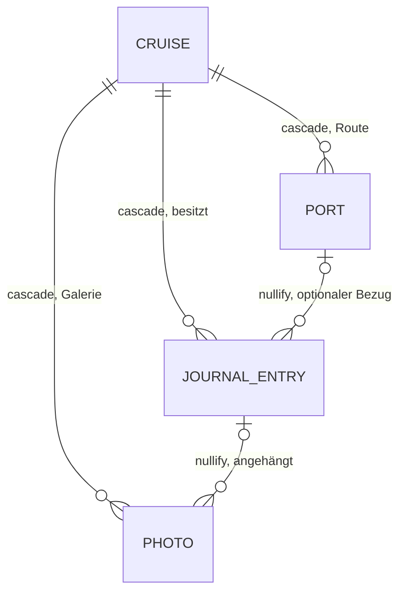

# Contract — Journal-Editor („Erinnerung zuerst, Eckdaten als Zweitschritt")

**Status:** Verbindlich für Run 1.8.5, Wellen T5 (Design), T7 (Modell) und
T8 (UI) — Stand 2026-08-27, gehört zu
[ADR-003](../../adr/ADR-003-journal-kern.md).
Diese Datei ist die Naht: Designer (T5) und Modell-Dev (T7) bauen unabhängig
gegen diesen Contract, nicht gegeneinander. Änderungen gehen über Winston,
nicht still per Diff.

Rev. 2026-08-27/2 (über Winston, nach Codex-Gate #4): `entryDate` auf
Date-only-Semantik umgestellt (Finding 3) und LWW-Mutations-Matrix als J2a
ergänzt (Finding 2); Details im Zeitzonen- bzw. LWW-Vertrag von ADR-003.

---

## J1 — Datenmodell-Naht (verbindliche Namen, Typen, Defaults)

T7 implementiert exakt diese Felder; T5/T8 dürfen sich auf die Namen verlassen.
Alle Regeln CloudKit-konform nach ADR-002 §3 (Defaults, optionale
Relationships, keine `.unique`; Dedup über stabile `id: UUID`).

### Neues Modell `JournalEntry`

| Feld | Typ | Default | Bedeutung |
|---|---|---|---|
| `id` | `UUID` | `UUID()` | Stabile App-ID, kein Unique-Constraint (ADR-002 §4) |
| `text` | `String` | `""` | Die Erinnerung (Freitext, mehrzeilig) |
| `entryDate` | `Date` | `Date()` (reiner Schema-Default, CloudKit-Pflicht — nie unnormalisiert persistieren) | Kalendertag als **Date-only-Wert**: **jeder Schreibpfad** (Editor-Save, Import/T7b) persistiert **12:00 UTC** des Tag-Tripels — importierte Werte werden auf 12:00 UTC ihres UTC-Tag-Tripels normalisiert. Tag-Extraktion nur über UTC-Kalender; Vergleiche auf Tag-Tripeln (Jahr/Monat/Tag, s. J2), nie `==`, nie lokales `startOfDay` |
| `moodRaw` | `String` | `""` | Stimmung als stabiler Roh-String (s. J4); `""` = keine Stimmung |
| `createdAt` | `Date` | `Date()` | Erstellungsdatum |
| `updatedAt` | `Date` | `Date()` | Last-Writer-Wins, bei jedem Save bumpen (ADR-002 §2) |
| `cruise` | `Cruise?` | — | Zugehörige Reise (inverse Seite) |
| `port` | `Port?` | — | Optionaler Hafen-Bezug (inverse Seite) |
| `photosStorage` | `[Photo]?` | — | `@Relationship(deleteRule: .nullify, inverse: \Photo.journalEntry)`; computed Wrapper `photos: [Photo]` nach Cruise-Muster |

Abgeleitet, **nicht** gespeichert: Reisetag-Nummer („Tag 3") =
Kalendertag-Differenz der **Tag-Tripel** (Zeitzonen-Vertrag: `entryDate`
via UTC-Kalender, `cruise.startDate` via Geräte-Kalender) + 1 — nie rohe
`Date`-Differenz (UI-berechnet, kein Drift-Risiko).
Kein `isDemo` auf `JournalEntry` — Demo-Filterung läuft wie bei
Port/Expense/Photo über `cruise?.isDemo`.

### Erweiterungen bestehender Modelle (alle additiv)

| Modell | Neues Feld | Typ/Default | Regel |
|---|---|---|---|
| `Photo` | `caption` | `String = ""` | Bildunterschrift, optional befüllbar |
| `Photo` | `journalEntry` | `JournalEntry?` | Inverse zu `JournalEntry.photosStorage`; Foto bleibt zusätzlich `cruise`-Kind (Galerie + Aggregate unverändert) |
| `Cruise` | `journalEntriesStorage` | `[JournalEntry]?` | `@Relationship(deleteRule: .cascade, inverse: \JournalEntry.cruise)` + computed `journalEntries: [JournalEntry]` nach bestehendem Storage-Muster |
| `Port` | `journalEntriesStorage` | `[JournalEntry]?` | `@Relationship(deleteRule: .nullify, inverse: \JournalEntry.port)`; kein computed Wrapper nötig (kein UI-Bedarf) |

Löschregeln: Reise löschen → Einträge weg (cascade). Eintrag löschen →
Fotos bleiben in der Reise-Galerie (`journalEntry` wird genullt). Hafen
löschen → Eintrag bleibt, `port` wird genullt.

---

## J2 — Editor-Flow (Reihenfolge ist der Vertrag, Darstellung ist Design)

Zwei Schritte, feste Reihenfolge. Ob als zwei Screens, ein Scroll-Flow oder
Sheet mit Fortschritt, entscheidet T5 — die Priorität „Erinnerung prominent
zuerst, Eckdaten nachgelagert" ist verbindlich.

**Schritt 1 „Erinnerung"** (Einstieg, keine Pflicht-Metadaten davor):

| Feld | Eingabe | Regel |
|---|---|---|
| Text | mehrzeiliger Texteditor | Pflichtregel: Weiter/Speichern erst, wenn Text nicht leer **oder** ≥ 1 Foto gewählt |
| Fotos | Foto-Picker, 0–n | Neue Fotos werden beim Save als `Photo` mit `cruise` = Reise **und** `journalEntry` = Eintrag angelegt; `sortOrder` ans Ende der bestehenden Galerie |
| Caption je Foto | einzeilig, optional | Default `""`; Eingabe direkt am Foto-Thumbnail |

**Schritt 2 „Eckdaten"** (alles vorbelegt, User kann durchwinken):

| Feld | Eingabe | Default-Regel |
|---|---|---|
| Tag/Datum | Datums-Auswahl, begrenzt auf `[cruise.startDate, cruise.endDate]` | Heute (Tag-Tripel im Geräte-Kalender), geklemmt auf den Reisezeitraum (vor der Reise → Starttag, danach → Endtag); Klemmen und Grenzen als Tag-Tripel-Vergleich nach Zeitzonen-Vertrag (ADR-003), persistiert als 12:00 UTC des gewählten Tags |
| Hafen-Bezug | Auswahl über `cruise.route` (nach `sortOrder`, inkl. Seetage) + Option „Kein Hafen" | Erster Route-Stopp, dessen `arrival` auf dem gewählten Tag liegt (Tag-Tripel: `arrival` via Geräte-Kalender, Eintragstag via UTC-Kalender); sonst kein Hafen. Bei Datumswechsel neu berechnet, solange der User nicht manuell gewählt hat |
| Stimmung | 5 Optionen + „keine" (s. J4) | Keine Stimmung (`moodRaw == ""`) |

**Save-Semantik:** Speichern erst am Ende von Schritt 2 (ein Insert, kein
Zwischenspeichern); Abbrechen verwirft Eintrag und noch nicht gespeicherte
Fotos. Alle Timestamp-Bumps folgen der Matrix J2a.

**Bearbeiten:** gleicher Editor, alle Felder vorbelegt, gleiche Reihenfolge.
**Löschen:** aus dem Tagebuch-Strang; löscht nur den Eintrag (Fotos bleiben);
Bumps nach J2a.

### J2a — LWW-Mutations-Matrix (verbindlich, T7-Tests decken jede Zeile ab)

Konfliktregel: LWW pro Objekt über `updatedAt` (ADR-002 §2, ADR-003
LWW-Vertrag). `createdAt` wird einmal beim Insert gesetzt und danach **nie**
verändert. SwiftData-Nullify bumpt nichts automatisch — die Lösch-Pfade
führen die markierten Bumps explizit aus.

| Mutation | `entry.createdAt` | `entry.updatedAt` | `photo.updatedAt` |
|---|---|---|---|
| Eintrag anlegen (Save Schritt 2) | = now, danach unveränderlich | = `createdAt` | neue Fotos: gesetzt beim Anlegen |
| `text` / `entryDate` / `moodRaw` ändern | — | bump | — |
| Hafen setzen / wechseln / entfernen (Editor) | — | bump | — |
| Foto anhängen (neu oder bestehend) | — | bump | bump (Link `journalEntry` geändert) |
| Foto abhängen (Detach im Editor) | — | bump | bump |
| Caption ändern | — | — | bump |
| Foto aus Galerie löschen (Photo entfällt, hing an Eintrag) | — | bump, explizit im Lösch-Pfad | (Objekt entfällt) |
| Eintrag löschen → Nullify `photo.journalEntry` | (Objekt entfällt) | (Objekt entfällt) | bump je betroffenem Foto, explizit im Lösch-Pfad |
| Hafen löschen → Nullify `entry.port` | — | bump, explizit im Lösch-Pfad | — |
| Reise löschen (Cascade) | (Objekt entfällt) | (Objekt entfällt) | (Fotos entfallen mit) |

---

## J3 — Tagebuch-Strang (Lesansicht in `CruiseDetailView`)

- Sortierung: `entryDate` aufsteigend, innerhalb eines Tags `createdAt`
  aufsteigend; Gruppierung pro Kalendertag (Tag-Karten, Pin-Farb-Akzent
  gemäß Karten-Redesign-Tokens).
- Mehrere Einträge pro Tag sind erlaubt (kein Unique möglich und nicht
  gewollt).
- Tag-Karte zeigt: Reisetag-Nummer + Datum, optionalen Hafen, Stimmung,
  Text(auszug), Foto-Thumbnails mit Caption.

---

## J4 — Stimmungs-Skala (stabile Rohwerte)

`moodRaw` speichert genau einen dieser Werte (oder `""` = keine). Rohwerte
sind export- und sync-stabil und werden nie umnummeriert; Anzeige-Emoji und
lokalisierte Labels (DE/EN, T8/String-Katalog) sind Design-Sache.

| Rohwert | Vorschlag Emoji | Bedeutung |
|---|---|---|
| `great` | 🤩 | Großartig |
| `good` | 🙂 | Gut |
| `okay` | 😐 | Okay |
| `bad` | 🙁 | Nicht so gut |
| `awful` | 😢 | Schlecht |

---

## J5 — ER-Übersicht

Legende: `JOURNAL_ENTRY` und die Kanten zu `PORT`/`PHOTO` sind neu (1.8.5);
alle übrigen Kanten bestehen seit ADR-002.
