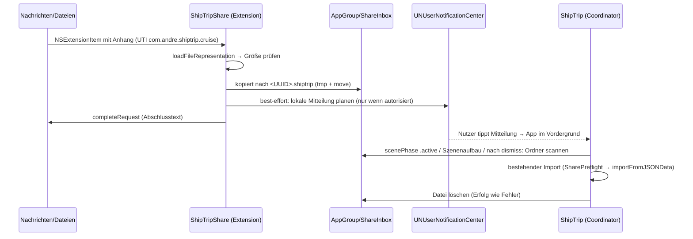

# Contracts — Share-Extension `ShipTripShare` (Übergabe per App Group)

**Status:** Verbindlich für die Workstreams S0/A/B/V (Iteration 2, Stand
2026-09-10; gehört zu
[ADR-010](../../adr/ADR-010-share-extension-app-group-handoff.md); baut auf
[share-cruise-contracts.md](share-cruise-contracts.md) C3/C6/C10 auf).
Diese Datei ist die Naht: A (Extension) und B (App-Seite) bauen gegen diese
Verträge, nicht gegeneinander. Änderungen gehen über Winston.

**Verifikationsstand:** Fakten mit „(verifiziert)" stammen aus Apple-Doku, die
am 2026-09-10 gelesen wurde (Quellen im ADR). „(unverifiziert)" = Modellwissen,
Forums- oder Community-Aussage, am Simulator/Gerät zu prüfen.

**Änderungen gegenüber Iteration 1 (Review Gate #4):** H1 gestrichen (kein
`file=`, kein Router-Fall — F03/F02); H5 ersetzt Responder-Chain durch lokale
Mitteilung (F01); H3 mit Test-Nähten (F04) und Re-Scan nach `dismiss` (F12);
H4 mit expliziter Plist-Liste (F05), Apple-Prädikatform (F11), Diagnose-Reihenfolge
vor Rückfall (F10), Principal Class (F15), typisierte Ladefunktion (F16); H5 mit
finalem Wortlaut (F20); H6 vollständig gegen das Widget-Target (F06–F08);
Parallelisierungsplan mit Pfaden, pbxproj-Exklusivität und Schritt V (F09, F13,
F17, F21). Backlog-Markierungen am Ende.

---

## Überblick



## H1 — URL-Vertrag: **keine Änderung**

`shiptrip://import` bleibt exakt wie in C3 (`IncomingLink.importHint`).
`IncomingLinkRouter.swift` und `IncomingLinkRouterTests.swift` werden **nicht
angefasst**. Es gibt keinen Query-Parameter und keinen neuen Router-Fall; der
Vordergrund-Scan (H3) ist der einzige Import-Trigger für Übergabedateien.

## H2 — App-Group-Übergabeordner (`ShareHandoffStore`, Foundation-only)

Neue Datei `ShipTrip/ShareShared/ShareHandoffStore.swift`, Mitglied in **App
und Extension** (per `membershipExceptions` wie `WidgetShared/`, siehe
`CLAUDE.md` und H6). Regeln wie für `WidgetShared`: nur Foundation, kein
SwiftData, kein SwiftUI, keine `String(localized:)`.

| Vertrag | Wert |
|---|---|
| Container | `FileManager.default.containerURL(forSecurityApplicationGroupIdentifier: "group.com.andre.ShipTrip")` — `nil` ⇒ Aufrufer behandelt es (Extension: Fehlerstatus; App: kein Scan). Verhalten im Projekt durch `WidgetSnapshotStore.appGroupURL()` belegt |
| Ordner | `<Container>/ShareInbox/` (wird bei Bedarf mit `createDirectory(withIntermediateDirectories:)` angelegt) |
| Namensschema | `<UUID>.shiptrip`, UUID von der Extension frisch erzeugt (`UUID().uuidString`, Großschreibung). Der Anzeigename der Quelldatei wird **nicht** übernommen |
| Schreiben (Extension) | `copyItem` in eine `.tmp`-Datei im selben Ordner (`<UUID>.tmp`), dann `moveItem` auf `<UUID>.shiptrip` (atomar sichtbar: die App sieht nie eine halbe Datei) |
| Scan-Regel (App) | `pendingFiles(in:)` liest **nicht rekursiv** (`contentsOfDirectory(at:includingPropertiesForKeys:options:)` mit `.skipsSubdirectoryDescendants`, `.skipsHiddenFiles`) und nimmt nur Einträge, die **alle** Bedingungen erfüllen: `isRegularFile == true`, `isSymbolicLink != true`, `isValidHandoffName(lastPathComponent)`. Einträge mit unlesbaren `resourceValues` werden übersprungen. Sortierung: Änderungsdatum aufsteigend, Tiebreak Dateiname aufsteigend. Damit gibt es keinen Weg, über den Übergabeordner auf eine Datei außerhalb zu zeigen |
| Namensprüfung | `isValidHandoffName`: reine String-Prüfung, **nicht** über `URL`: Länge exakt 45, Zeichen 1–36 ergeben mit `UUID(uuidString:)` eine UUID, Zeichen 37–45 sind `.shiptrip` (case-insensitiv). Kein `/`, `\`, `..` möglich per Konstruktion |
| Aufräumregel | **Extension**, vor jedem Schreiben: Einträge in `ShareInbox/` mit Änderungsdatum älter als **24 Stunden** löschen (auch `.tmp`-Reste). **App**: nach jedem Import (Erfolg wie Fehler) die importierte Datei löschen (H3). Keine weitere Buchhaltung |
| Größenlimit (Extension) | vor dem Kopieren: Dateigröße der gelieferten Repräsentation ≤ `ShareArchiveLimits.maxArchiveFileSize` (275 MB, `ShipTrip/Services/ShareArchiveLimits.swift`, Foundation-only, ebenfalls per `membershipExceptions` in die Extension). Größer ⇒ Fehlerstatus, nichts kopieren. Alle weiteren Prüfungen (C10) macht die App |

```swift
/// Übergabeordner der Share-Extension im App-Group-Container (ADR-010, H2).
enum ShareHandoffStore {
    static let groupID = "group.com.andre.ShipTrip"
    static let folderName = "ShareInbox"
    static let fileExtension = "shiptrip"
    static let maxAge: TimeInterval = 24 * 60 * 60

    /// nil = App-Group-Entitlement fehlt.
    static func inboxURL(groupID: String = groupID) -> URL?
    /// Reine String-Prüfung (Schema `<UUID>.shiptrip`). Unit-testbar.
    static func isValidHandoffName(_ name: String) -> Bool
    /// Reguläre, gültig benannte Dateien direkt im Ordner, älteste zuerst.
    static func pendingFiles(in inbox: URL) -> [URL]
    /// Löscht Einträge älter als `maxAge` (Extension-Seite).
    static func removeStaleFiles(in inbox: URL, now: Date = .now)
}
```

Unit-Tests (B, `ShipTripTests/ShareHandoffStoreTests.swift`, Wegwerf-Ordner
unter `FileManager.default.temporaryDirectory`): gültiger Name · `../`-, `a/b/`-,
Leer- und 44/46-Zeichen-Namen ungültig · `pendingFiles` ignoriert `.tmp`,
Unterordner, Symlink auf Datei außerhalb, falsch benannte Datei · Sortierung
älteste zuerst · `removeStaleFiles` löscht nur > 24 h.

## H3 — App-Seite: `ShareImportCoordinator` + `shouldRemoveAfterImport`

**Löschregel (Erweiterung C6), Signatur mit Test-Naht (F04):**

```swift
static func shouldRemoveAfterImport(
    _ url: URL,
    inbox: URL? = ShareHandoffStore.inboxURL()
) -> Bool
```

Liefert zusätzlich `true`, wenn `inbox != nil` und der normalisierte Pfad mit
`normalizedPath(inbox) + "/"` beginnt. Die bestehende Symlink-Normalisierung
bleibt Pflicht (Group-Container liegt unter
`/private/var/mobile/Containers/Shared/AppGroup/…`). Alle vier bestehenden
Aufrufe und Tests (`ShareImportCleanupTests.swift`) bleiben unverändert. Neuer
Test übergibt ein Wegwerf-Verzeichnis: Datei darin ⇒ `true`;
Geschwister-Ordner mit gleichem Präfix (`ShareInbox2/`) ⇒ `false`; `inbox: nil`
⇒ Verhalten wie heute. **Vor dem Fix rot** (Parameter existiert nicht).

**Vordergrund-Scan (einziger Import-Trigger), Signatur mit Test-Naht:**

```swift
extension ShareImportCoordinator {
    /// Tragender Weg (ADR-010): nur in `.idle`; nimmt
    /// `ShareHandoffStore.pendingFiles(in:).first` (älteste) und ruft
    /// `startImport(of:)`. `inbox == nil` oder leer ⇒ tut nichts.
    func importPendingHandoffIfIdle(
        modelContext: ModelContext,
        inbox: URL? = ShareHandoffStore.inboxURL()
    )
}
```

Verdrahtung in `ShipTripApp` (oberhalb von `.modelContainer`, wie C6), genau
drei Aufrufstellen:
1. `onChange(of: scenePhase)`: bei `.active` (im bestehenden Block neben
   `widgetPublisher?.publish()`).
2. Im bestehenden `.task` (einmalig beim Szenenaufbau, neben `publishNow()`).
3. Nach `shareImportCoordinator.dismiss()` im Ergebnis-Sheet (beide
   `dismiss`-Stellen) — damit eine zweite anstehende Datei nicht bis zum
   24-h-Aufräumen liegen bleibt (F12).

Single-Flight (C10) bleibt: Läuft schon ein Import oder steht ein Ergebnis
(`.importing`/`.finished`/`.failed`/`.linkHint`), wird der Scan verworfen.
`handleIncomingURL` bleibt unverändert.

Unit-Test für den Scan (B, `ShipTripTests/ShareImportHandoffScanTests.swift`,
In-Memory-`ModelContainer` wie in `ShareImportPreflightTests`, Fixture aus
`ShareImportFixtures`): Ordner mit gültiger Datei ⇒ Zustand verlässt `.idle`
und die Datei ist nach Abschluss gelöscht · leerer Ordner ⇒ bleibt `.idle` ·
Zustand `.finished` ⇒ kein Import · `inbox: nil` ⇒ kein Import. **Vor dem Fix
rot** (Methode existiert nicht).

**Kein neuer Zustand, keine neuen Strings** in der App: `.importing`,
`.finished`, `.failed`, `.linkHint` decken alles ab (C8-Katalog bleibt
gesperrt).

## H4 — Extension-`Info.plist`: Schlüssel, Aktivierungsregel, UTI

**Herkunft und vollständige Schlüsselliste (F05).** Vorlage ist
`ShipTripWidget/Info.plist` (nur `NSExtension`-Dictionary), **nicht**
`ShipTrip-Info.plist`. Die Extension-Plist enthält genau:

| Schlüssel | Wert |
|---|---|
| `NSExtension` → `NSExtensionPointIdentifier` | `com.apple.share-services` |
| `NSExtension` → `NSExtensionPrincipalClass` | `$(PRODUCT_MODULE_NAME).ShareViewController` (kein Storyboard, kein `NSExtensionMainStoryboard`) |
| `NSExtension` → `NSExtensionAttributes` → `NSExtensionActivationRule` | Prädikat-String (unten) |
| `UTImportedTypeDeclarations` | ein Eintrag: `UTTypeIdentifier com.andre.shiptrip.cruise`, `UTTypeDescription ShipTrip-Reise`, `UTTypeConformsTo [public.data, public.content]`, `UTTypeTagSpecification { public.filename-extension: [shiptrip] }` — Werte aus `ShipTrip-Info.plist` Zeilen 9–29 |

**Ausdrücklich verboten** in der Extension-Plist: `UIBackgroundModes` (Apple,
verifiziert: „the extension will be rejected by the App Store"),
`CFBundleDocumentTypes`, `CFBundleURLTypes`, `UTExportedTypeDeclarations`.
Alle übrigen Bundle-Schlüssel (`CFBundleDisplayName`, Version, Build) erzeugt
`GENERATE_INFOPLIST_FILE = YES` aus den Build-Settings (H6).

**`NSExtensionActivationRule` als Prädikat-String** — Form verifiziert, aber
nur in der **Archivdoku** (App Extension Programming Guide, ExtensionScenarios;
in der aktuellen Referenz gibt es keinen Ersatzartikel). Innenform exakt nach
Apples Beispiel („alle Anhänge passen"), das ist zugleich die
„genau eine Datei"-Semantik aus ZIEL #1 (F11):

```
SUBQUERY (
  extensionItems,
  $extensionItem,
  SUBQUERY (
    $extensionItem.attachments,
    $attachment,
    ANY $attachment.registeredTypeIdentifiers UTI-CONFORMS-TO "com.andre.shiptrip.cruise"
  ).@count == $extensionItem.attachments.@count
).@count == 1
```

Kein `TRUEPREDICATE` — auch nicht vorübergehend im Branch (verifiziert: Store-
Ablehnung). Warum kein Dictionary: `NSExtensionActivationSupportsFileWithMaxCount = 1`
matcht **jeden** Dateityp — ShipTrip stünde dann auch bei PDFs im Sheet.

**Anhang wählen und laden.** Der Anhang wird per
`attachments.first(where: { $0.hasItemConformingToTypeIdentifier("com.andre.shiptrip.cruise") })`
gewählt, nie per Index. Laden über
`loadFileRepresentation(for: UTType("com.andre.shiptrip.cruise")!, openInPlace: false)`
(iOS 16+, verifiziert). Für die untypisierte Variante ist verifiziert, dass die
Temp-Datei nach Rückkehr des Handlers gelöscht wird; für die typisierte Variante
ist das Löschverhalten nicht in der Referenz belegt (unverifiziert) — die Kopie
nach H2 erfolgt deshalb in jedem Fall **synchron innerhalb des
Completion-Handlers**.

**Gerätetest-Pflicht, Diagnose-Reihenfolge, Rückfallposition (F10).** Ob
Nachrichten den Anhang mit dem exportierten UTI in `registeredTypeIdentifiers`
liefert, lässt sich nur am Gerät prüfen (kein iMessage im Simulator). Greift das
Prädikat dort nicht:
1. **Erste Hypothese: UTI nicht registriert** — ist die App installiert, ist die
   exportierte Deklaration in der App-Plist intakt, kommt die Datei mit Endung
   `.shiptrip` an? Prüfen, bevor am Prädikat gedreht wird.
2. Zweite Hypothese: Host liefert einen Begleit-Anhang (z. B. `public.url`),
   sodass „alle Anhänge passen" fehlschlägt — Anhangsliste am Gerät loggen.
3. **Letzte Option** (Contract-Änderung mit Winston-Rückmeldung, kein stiller
   Diff): Prädikat auf `UTI-CONFORMS-TO "public.file-url"` plus Laufzeitprüfung
   der Endung in der Extension (sonst `cancelRequest`). Nachteil beim Namen:
   **ShipTrip erscheint dann im Teilen-Sheet bei allen Dateien** — genau der
   oben abgelehnte Effekt, nur als bewusster Notnagel.

Ob `UTImportedTypeDeclarations` in der Extension zwingend ist, ist
unverifiziert; die Doppeldeklaration ist unschädlich (verifiziert: „the exported
declaration takes precedence over imported one").

## H5 — Abschluss in der Extension: Abschlusstext + lokale Mitteilung

Kein Versuch, die App zu öffnen. Weder `extensionContext.open` (für Share-
Extensions nicht zugesichert, verifiziert) noch Responder-Chain (von Apple DTS
abgelehnt; gestrichen, F01).

**Ablauf nach erfolgreichem Kopieren (Reihenfolge verbindlich):**
1. Berechtigung lesen: `UNUserNotificationCenter.current().notificationSettings()`.
   Nur bei `authorizationStatus == .authorized` (nicht `.provisional`, nicht
   `.notDetermined`; **keine** Abfrage aus der Extension) weiter mit 2, sonst
   direkt 3.
2. Mitteilung planen: `UNNotificationRequest(identifier: "share.handoff",
   content:, trigger: nil)` — `trigger: nil` ⇒ sofortige Zustellung
   (verifiziert). Inhalt: Titel und Text aus der Tabelle unten, `sound: .default`,
   kein `categoryIdentifier`, kein `userInfo`. Fehler beim `add` werden
   ignoriert (best-effort). Fester Identifier: eine zweite Übergabe ersetzt die
   erste Mitteilung statt sie zu stapeln. Der Identifier beginnt nicht mit
   `reminder.`, damit `NotificationReconciler.isManaged` ihn nie anfasst.
3. Abschlusstext „Übergeben" mit Schließen-Button anzeigen, dann
   `extensionContext.completeRequest(returningItems: nil)`.
4. Kopieren fehlgeschlagen / zu groß / kein Container ⇒ Fehltext + Button, dann
   `cancelRequest(withError:)`. Keine Mitteilung.

Antippen der Mitteilung öffnet ShipTrip (Systemverhalten); `scenePhase` wird
`.active`, H3 importiert. Die App braucht **keinen** `UNUserNotificationCenterDelegate`
dafür (heute existiert keiner; das bleibt so).

**Verifikationsstand:** `UNUserNotificationCenter` ist laut Apple-Referenz „the
central object for managing notification-related activities for your app or app
extension" (verifiziert). Ob eine **Share**-Extension die Berechtigung der
Container-App liest und zustellen darf, ist **unverifiziert** (Apple DTS:
„I suspect that it'll vary based on the extension type"). Nachweis in Schritt V
im Simulator (App vorher Berechtigung erteilen). **Rückfallposition:** liefert
der Simulator keine Mitteilung, werden Schritte 1–2 entfernt; es bleibt der
Abschlusstext. Der Import-Weg ändert sich dadurch nicht.

**Extension-Strings** (eigener String Catalog `ShipTripShare/Localizable.xcstrings`,
Muster Widget; der App-Katalog bleibt unberührt). Finaler Wortlaut (F20):

| Schlüssel | DE | EN |
|---|---|---|
| `handoff.progress` | Wird an ShipTrip übergeben … | Handing over to ShipTrip … |
| `handoff.done` | An ShipTrip übergeben. Öffne ShipTrip, um die Reise zu importieren. | Handed over to ShipTrip. Open ShipTrip to import the trip. |
| `handoff.tooLarge` | Die Datei ist zu groß (max. 275 MB). | The file is too large (max. 275 MB). |
| `handoff.failed` | Übergabe fehlgeschlagen. Bitte erneut versuchen. | Handoff failed. Please try again. |
| `handoff.notification.title` | Reise bereit zum Import | Trip ready to import |
| `handoff.notification.body` | Antippen öffnet ShipTrip. | Tap to open ShipTrip. |
| `handoff.close` | Schließen | Close |

`scripts/check-l10n.py` erfasst den neuen Katalog automatisch (`rglob("*.xcstrings")`);
DE/EN vollständig ist Definition-of-Done für A (F13).

## H6 — Target, Bundle, Entitlements, Build-Settings, pbxproj, Signing

| Vertrag | Wert |
|---|---|
| Target-Name / Ordner | `ShipTripShare` / `ShipTripShare/` mit `Info.plist`, `ShipTripShare.entitlements`, `ShareViewController.swift`, `Localizable.xcstrings` |
| Bundle-ID | `com.andre.ShipTrip.Share` |
| Entitlements-Datei | `ShipTripShare/ShipTripShare.entitlements`, Inhalt **nur** `com.apple.security.application-groups = [group.com.andre.ShipTrip]` (Kopie von `ShipTripWidget/ShipTripWidget.entitlements`). Kein `aps-environment` (lokale Mitteilungen brauchen es nicht) |
| Build-Settings (F06/F07) | **1:1 aus dem Widget-Target klonen**, Debug **und** Release (`project.pbxproj:699-754`). Abweichend nur: `PRODUCT_BUNDLE_IDENTIFIER = com.andre.ShipTrip.Share`, `INFOPLIST_FILE = ShipTripShare/Info.plist`, `CODE_SIGN_ENTITLEMENTS = ShipTripShare/ShipTripShare.entitlements`. Unverändert übernommen und **Pflicht**: `INFOPLIST_KEY_CFBundleDisplayName = ShipTrip` (Name im Teilen-Sheet, ZIEL #1), `CODE_SIGN_STYLE = Automatic`, `DEVELOPMENT_TEAM = LH324Y9MG7`, `GENERATE_INFOPLIST_FILE = YES`, `IPHONEOS_DEPLOYMENT_TARGET = 18.5`, `LD_RUNPATH_SEARCH_PATHS = (@executable_path/Frameworks, @executable_path/../../Frameworks)`, `MARKETING_VERSION = 1.9.0`, `CURRENT_PROJECT_VERSION` = Wert der App (Store-Pflicht; Schritt V hebt alle drei auf 31), `PRODUCT_NAME = $(TARGET_NAME)`, `SDKROOT = auto`, `SKIP_INSTALL = YES`, `SUPPORTED_PLATFORMS = "iphoneos iphonesimulator"`, `SWIFT_EMIT_LOC_STRINGS = YES`, `SWIFT_STRICT_CONCURRENCY = complete`, `SWIFT_VERSION = 6.0`, `TARGETED_DEVICE_FAMILY = 1` |
| Developer-Portal (manuell, Andre) | neue App-ID `com.andre.ShipTrip.Share` mit Capability App Groups → `group.com.andre.ShipTrip`; neues Distribution-Profil **„ShipTrip Share App Store"** |
| `fastlane/Fastfile` `fetch_profile` | dritter `get_provisioning_profile`-Block nach dem Widget-Muster (`Fastfile:312-320`): `app_identifier "com.andre.ShipTrip.Share"`, `provisioning_name "ShipTrip Share App Store"`, `filename "ShipTrip_Share_AppStore.mobileprovision"` |
| `docs/SETUP.md` Archiv-Befehl (`:179-184`) | zusätzlich `PROFILE_ShipTripShare="ShipTrip Share App Store"`; Satz „für beide Bundle-IDs" (`:187-188`) auf drei erweitern |
| `build/ExportOptions.plist` (`:13-19`) | dritter `provisioningProfiles`-Eintrag `com.andre.ShipTrip.Share` → `ShipTrip Share App Store` |

Hinweis: `PROFILE_`-Variablen existieren nur im dokumentierten
`xcodebuild`-Aufruf (`docs/SETUP.md`), nicht im `Fastfile`.

### pbxproj-Objektliste (F08) — Widget-Target als Kopiervorlage

Das Projekt nutzt synchronisierte Ordner (`objectVersion = 77`, leere
`files`-Listen in den Build-Phasen). Jede Zeilenangabe zeigt das entsprechende
Widget-Objekt in `ShipTrip.xcodeproj/project.pbxproj` (Stand Branch-Basis);
für `ShipTripShare` wird jedes analog mit neuen 24-stelligen Hex-IDs angelegt.
Diese Liste ist zugleich die Abnahme-Checkliste für A.

| # | Objekt | Widget-Beleg | Für `ShipTripShare` |
|---|---|---|---|
| 1 | `PBXBuildFile` „ShipTripShare.appex in Embed Foundation Extensions", `settings = {ATTRIBUTES = (RemoveHeadersOnCopy, ); }` | `:10` | neu |
| 2 | `PBXContainerItemProxy` (`proxyType = 1`, `remoteGlobalIDString` = ID des Share-Targets, `remoteInfo = ShipTripShare`) | `:28-34` | neu |
| 3 | Eintrag in der **bestehenden** `PBXCopyFilesBuildPhase` „Embed Foundation Extensions" (`dstSubfolderSpec = 13`) — `files` um #1 ergänzen, keine zweite Phase | `:38-48` | ergänzen |
| 4 | `PBXFileReference` `ShipTripShare.appex` (`explicitFileType = "wrapper.app-extension"`, `includeInIndex = 0`, `sourceTree = BUILT_PRODUCTS_DIR`) | `:55` | neu |
| 5 | `PBXFileSystemSynchronizedBuildFileExceptionSet` „Exceptions for "ShipTrip" folder in "ShipTripShare" target" mit `membershipExceptions = (ShareShared/ShareHandoffStore.swift, Services/ShareArchiveLimits.swift)`, `target` = Share-Target | `:59-70` | neu |
| 6 | Referenz auf #5 in `exceptions` der Root-Group `ShipTrip` | `:96-103` | ergänzen |
| 7 | `PBXFileSystemSynchronizedBuildFileExceptionSet` „Exceptions for "ShipTripShare" folder in "ShipTripShare" target" mit `membershipExceptions = (Info.plist,)` — sonst landet die Plist zusätzlich als Ressource im Bundle | `:86-92` | neu |
| 8 | `PBXFileSystemSynchronizedRootGroup` `ShipTripShare` (`path = ShipTripShare`, `exceptions = (#7)`) — wie beim Widget **nicht** in `children` der Main-Group | `:114-122`, Main-Group `:157-166` | neu |
| 9 | Eintrag `ShipTripShare.appex` in der `Products`-Group | `:173` | ergänzen |
| 10 | Drei leere Build-Phasen: `PBXSourcesBuildPhase`, `PBXFrameworksBuildPhase`, `PBXResourcesBuildPhase` (`buildActionMask = 2147483647`, `files = ()`) | Widget-IDs `BF1F2904…/05…/06…` | neu |
| 11 | `PBXNativeTarget` `ShipTripShare` (`productType = "com.apple.product-type.app-extension"`, `buildPhases` = #10, `fileSystemSynchronizedGroups = (#8)`, `productReference` = #4, `buildConfigurationList` = #15) | `:251-272` | neu |
| 12 | `PBXTargetDependency` (`target` = Share-Target, `targetProxy` = #2) | `:395-399` | neu |
| 13 | App-Target `ShipTrip`: `dependencies` um #12 ergänzen (Build-Phase „Embed Foundation Extensions" ist bereits eingehängt, `:188`) | `:192-194` | ergänzen |
| 14 | `PBXProject`: `TargetAttributes` (`CreatedOnToolsVersion = 16.4`) und `targets` um das Share-Target ergänzen | `:294-296`, `:317` | ergänzen |
| 15 | `XCConfigurationList` „Build configuration list for PBXNativeTarget "ShipTripShare"" mit zwei `XCBuildConfiguration` (Debug/Release, Settings siehe Tabelle oben) | `:794-802`, `:699-754` | neu |

**Nicht** analog anzulegen: das Widget-Exception-Set „Exceptions for
"ShipTripWidget" folder in "ShipTrip" target" (`:71-85`) — es zieht Widget-Views
für die Debug-Galerie in die App und hat für die Share-Extension kein
Gegenstück. Shared Schemes referenzieren das Widget-Target nicht
(`xcshareddata/` ohne Treffer), also auch keine Scheme-Änderung.

Abnahme für A: `xcodebuild -scheme ShipTrip -destination 'generic/platform=iOS Simulator' build`
baut, das Archiv enthält `PlugIns/ShipTripShare.appex`, und
`codesign -d --entitlements :- <appex>` zeigt die App Group.

## Parallelisierungsplan

**S0 — Seed (seriell, klein, ein Developer):**
- `ShipTrip/ShareShared/ShareHandoffStore.swift` (H2, vollständig implementiert
  — er ist reine Foundation-Logik und die Naht für A und B).
- Sonst nichts. Keine pbxproj-Änderung (der neue Ordner unter `ShipTrip/` wird
  vom synchronisierten Root `ShipTrip` automatisch ins App-Target aufgenommen;
  die Extension-Membership legt A über #5 an).

**Parallel danach — Schreib-Pfade disjunkt:**

| Strang | Schreibt ausschließlich |
|---|---|
| **A — Extension** | `ShipTripShare/*` (neu: `Info.plist`, `ShipTripShare.entitlements`, `ShareViewController.swift`, `Localizable.xcstrings`) · **`ShipTrip.xcodeproj/project.pbxproj`** (exklusiv A) · `fastlane/Fastfile` · `docs/SETUP.md` · `build/ExportOptions.plist` |
| **B — App-Seite** | `ShipTrip/Views/Share/ShareImportCoordinator.swift` · `ShipTrip/ShipTripApp.swift` (exklusiv B) · `ShipTripTests/ShareHandoffStoreTests.swift`, `ShipTripTests/ShareImportHandoffScanTests.swift` (neu), `ShipTripTests/ShareImportCleanupTests.swift` (Ergänzung) |

**pbxproj-Exklusivität:** Nur A fasst `project.pbxproj` an. B braucht keine
pbxproj-Änderung, weil `ShipTripTests` eine `PBXFileSystemSynchronizedRootGroup`
**ohne** Exception-Set ist (`project.pbxproj:104-108`, verifiziert) — neue
Testdateien im Ordner werden automatisch Mitglied des Test-Targets. A darf
`ShipTripApp.swift` und `ShareImportCoordinator.swift` nicht anfassen; B darf
`ShipTripShare/` und die Signing-Dateien nicht anfassen. Reihenfolge S0 → A ist
zwingend: #5 referenziert `ShareShared/ShareHandoffStore.swift`, das S0 anlegt.

**Definition-of-Done A:** Build grün (Simulator), Abnahme-Checkliste #1–#15
abgehakt, `python3 scripts/check-l10n.py` grün, Fastfile/SETUP/ExportOptions
ergänzt.
**Definition-of-Done B:** neue Tests vor dem Fix rot, nach dem Fix grün;
berührte Suite (`ShareImport*`, `IncomingLinkRouterTests`) grün.

**V — Nachweis (seriell, nach A + B; Owner: Winston delegiert an einen
Build/Test-Agenten, Screenshots an Andre):**
1. **Signiert bauen.** Für Simulator und Gerät ohne `CODE_SIGNING_ALLOWED=NO`
   bauen — das Flag strippt die Entitlements, `containerURL(...)` liefert dann
   `nil` und die Übergabe schlägt still fehl.
2. Wegwerf-Simulator (iPhone, iOS 18.5+) booten, App inkl. Appex installieren,
   App einmal öffnen und Mitteilungs-Berechtigung erteilen (Einstellungen →
   Erinnerungen).
3. Eine `.shiptrip`-Datei in die Dateien-App des Simulators legen: in ShipTrip
   eine selbst angelegte Reise (nicht die Beispielreise — Demo-Objekte sind aus
   dem Export ausgefiltert) über „Kreuzfahrt teilen" (ADR-007) exportieren →
   „In Dateien sichern" → „Auf meinem iPhone". Danach die Reise in ShipTrip
   löschen, damit der Import sie nicht als Duplikat überspringt.
4. Dateien-App → Datei lange drücken → Teilen → **Sheet-Screenshot: Eintrag muss
   „ShipTrip" heißen** (ZIEL #1, F06) → antippen → Abschlusstext-Screenshot.
5. Mitteilung erscheint? Ja ⇒ antippen; nein ⇒ als Befund notieren (H5-Rückfall
   entscheiden), App manuell öffnen.
6. Ergebnis-Sheet erscheint mit importierter Reise → Screenshot (ZIEL #7);
   `ShareInbox/` ist danach leer (per `xcrun simctl get_app_container … group`).
7. Berührte Suite über den Evidenz-Helfer fahren → `gate-run.json` Exit 0;
   `python3 scripts/check-l10n.py` grün.
8. Build-Bump: `CURRENT_PROJECT_VERSION = 31` in **allen drei** Targets (App,
   Widget, Share) — ZIEL #8.
9. Doku (ZIEL #9): `CHANGELOG.md` `[Unreleased]`,
   `docs/features/kreuzfahrt-teilen.md` Known Limitation „Keine Share-Extension"
   entfernen, `CLAUDE.md` um das dritte Target und `ShareShared/` ergänzen.
10. Erst danach der Gerätetest (Andre, TestFlight): iMessage-Anhang → Teilen →
    ShipTrip → Reise importiert (Prädikat-Verifikation H4, Mitteilung H5).

## Backlog (aus Review Gate #4, bewusst nicht in diesem Run)

- `fastlane/Fastfile:9-10` — `APP_STORE_VERSION`/`APP_STORE_BUILD` (1.7.0/23)
  veraltet; Bestand, nicht von diesem Change verursacht (F19).
- `ShipTripTests/` — keine Tests für `ShareImportCoordinator.handleIncomingURL`
  und Single-Flight (Bestandslücke).
