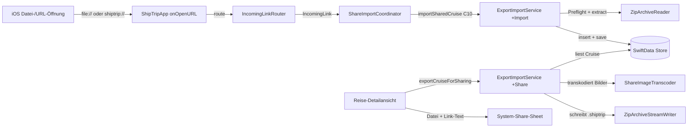
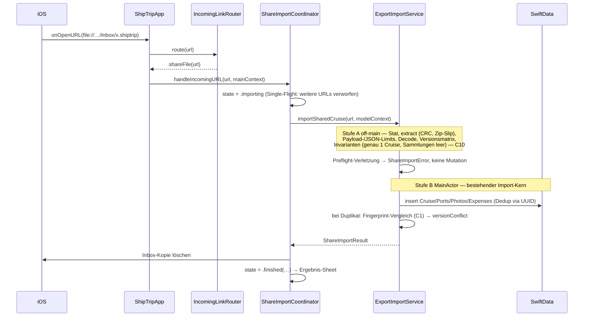

# Design — Feature „Kreuzfahrt teilen"

**Stand:** 2026-08-25 (Rev. 3 — Re-Review-Findings aus Gate #4, Iteration 2:
archiv-gebundene Share-Invariante, explizites `Task.detached`-Ausführungs-
modell, Versionsmatrix als Totalfunktion, sender-berechneter/empfänger-
persistierter Fingerprint, abschließender W0-Seed)
· **Entscheidung:** [ADR-007](../adr/ADR-007-kreuzfahrt-teilen.md)
· **Nähte:** [share-cruise-contracts.md](contracts/share-cruise-contracts.md)
· **Ziel:** `.planning/ZIEL-teilen.md`

Eine einzelne Kreuzfahrt wird als `.shiptrip`-Datei per Nachricht verschickt
(Datei + `shiptrip://`-Link); Antippen der Datei beim Empfänger öffnet
ShipTrip und importiert automatisch — alle Daten, Fotos komprimiert.

---

## 1. Leitentscheidung: Die Share-Datei ist ein Backup-Archiv

Die `.shiptrip`-Datei nutzt das bestehende Backup-Format (ZIP STORED +
`data.json`-Envelope v2) unverändert — eingeschränkt auf genau eine
Kreuzfahrt, mit komprimierten, metadatenfreien Bildern und einem
`share`-Metablock (im Envelope optionaler Key, in Share-Dateien Pflicht —
Contract C1). Kein zweites Format, kein zweiter Parser; der automatische
Share-Einstieg erzwingt die Einschränkungen beim Import (C10).

**Was wird wiederverwendet (verbindlich):**

| Baustein | Rolle im Teilen |
|---|---|
| `buildArchive` / `encodeArchive` | Envelope-Bau, unverändert (Eingabe: 1 Cruise, Rest leer) |
| `ExportImageSource` | Roh-Bytes-Lieferant auf dem MainActor (`@Model` bleibt auf dem MainActor) |
| Spool-basierte Größenprüfung (Muster `validateArchiveSize`) | Grenzprüfung vor dem Schreiben (über die Spool-Größen, §4) — gegen die engeren `ShareArchiveLimits` (C10) |
| `ZipArchiveStreamWriter` | strömendes Schreiben off-main, Alles-oder-nichts |
| `ZipArchiveReader` + Limits | kompletter Lesepfad inkl. Zip-Slip-/Bomben-/CRC-Härtung |
| `importFromZip` | kompletter Empfänger-Import inkl. Dedup, Validierung, Rollback |
| `ImageDownsampler`-Muster | Vorlage für den `ShareImageTranscoder` (ImageIO) |
| `ShareSheet`-Wrapper + Temp-Cleanup-Muster | Präsentation und Aufräumen (SettingsView-Export) |

**Was ist neu (und warum):**

| Neu | Warum nötig |
|---|---|
| `ShareImageTranscoder` (C4) | Kompression ist Share-spezifisch; Backup bleibt verlustfrei |
| Transcode-Spool (§4) | einmal transkodieren, exakt validieren, O(1) Speicher |
| `share`-Metablock + `exportCruiseForSharing` (C5) | Einzel-Cruise-Zuschnitt, Dateiname, Demo-Sperre |
| UTType/Dokumenttyp/Scheme in `ShipTrip-Info.plist` (C2/C3) | App-Registrierung für Doppeltipp + Link |
| `IncomingLinkRouter` + `ShareImportCoordinator` (C3/C6) | eine Auswertungsstelle für URLs, Zustand für die Import-UI |
| `importSharedCruise` + Preflight (C10) | Share-Einstieg erzwingt Invarianten/Limits/Version VOR jeder Mutation (Gate-#4-Blocker) |
| `ShareArchiveLimits` + `ShareFingerprint` (Seed W0, C0) | gemeinsame Grenzen für Export+Import; Inhalts-Fingerprint für den Versionskonflikt-Hinweis |
| Teilen-Aktion in der Reise-Detailansicht (C7) | Einstiegspunkt |

**Datenumfang:** Route, Notizen, Ausgaben, Bewertung, Kabinen-/Buchungsdaten,
Fotos, Hafenbilder — alles, immer (Clarify-Entscheid 2). Nicht dabei:
Wunschreisen/Deals (haben keine Modell-Beziehung zur Reise — „reisezugehörig"
ist damit die leere Menge) und das Katalog-Overlay (Reederei/Schiff stehen als
selbsttragende Strings in der Cruise; das Overlay ist Absender-Konfiguration,
keine Reisedaten — Empfänger sieht den Namen, Logo fällt auf 🛳️ zurück).
Beispielreise (`isDemo`): vom Teilen ausgeschlossen (Service wirft, UI blendet
aus) — bestehende Konvention.

## 2. Komponenten

Legende: blau = App-/UI-Schicht · grün = Services · gelb = Persistenz ·
violett = System/extern.

## 3. Import-Flow (Empfänger)

Festlegungen:

- **Automatisch, ohne Rückfrage** (Original-Anfrage): Antippen → App öffnet →
  Import läuft → sichtbares Ergebnis. Kein Vorschau-/Bestätigungsdialog; die
  „sichtbare Bestätigung" aus dem ZIEL ist das Ergebnis-Sheet
  (`importiert` / `bereits vorhanden` / Fehlertext aus `ImportError`).
- **Kalt- wie Warmstart** laufen über denselben `onOpenURL`-Handler; der
  Coordinator ist `@Observable`-State in `ShipTripApp` und die Präsentation
  hängt — wie Cover und Alert — **oberhalb von `.modelContainer(container)`**,
  damit sie den echten `mainContext` erbt (Lehre aus dem Onboarding-Demo-Bug).
- `shiptrip://import` ohne Datei → `state = .linkHint` (Hinweis-Sheet). Der
  Link kann die Datei technisch nicht transportieren; er ist die Beigabe, die
  App öffnet und den Nutzer zur Datei führt.
- Security-Scoped-Zugriff best-effort (Files-App-URLs brauchen ihn,
  Inbox-Kopien nicht); die Inbox-Kopie wird nach dem Import gelöscht — auch im
  Fehlerfall.
- **Archiv-gebundene Invariante (Rev. 3, statt „Share-Einstieg ≠
  Backup-Import"):** Ob Share- oder Backup-Semantik gilt, entscheidet der
  `share`-Block im Archiv, nicht der Einstiegspfad. Der Archiv-Preflight
  (Versionsmatrix, Invarianten „genau 1 Cruise, leere Sammlungen",
  Zählgrenzen) sitzt als Guard **im Import-Kern** `importFromJSONData` und
  greift damit in jedem Pfad — onOpenURL, manueller `fileImporter`,
  Legacy-JSON-Import. Manipulierte Mehr-Cruise-„Share"-Dateien werden in
  allen Türen abgelehnt statt massenimportiert (Gate-#4-Blocker, Iteration
  2). Backups ohne `share`-Block importieren in jedem Pfad unverändert wie
  bisher; die Größendeckel der `ShareArchiveLimits` binden nur den
  Share-Einstieg (Transport-Preflight, C10). Alt-Versions-Restrisiko
  (1.8.0-Bestand importiert Share-Dateien als Backup) ehrlich dokumentiert
  in C1.
- **Ausführungsmodell (Rev. 3, konkreter Übergang):** zweistufig. Stufe A
  (`SharePreflight.run` — Extraktion, Decode, gesamter Preflight) ist eine
  synchrone, zustandslose Funktion auf `URL`/`Data`/Export-DTOs; **off-main
  garantiert der Aufrufer** über `Task.detached(priority: .userInitiated)`
  im Coordinator-Task — nicht eine `nonisolated`-Deklaration (die unter
  Swift 6.x keinen Off-Main-Executor garantiert). Übergabetyp
  `SharePreflightResult: Sendable`; alle Export-DTOs tragen ab Seed W0
  explizite `Sendable`-Konformität (C0). Nach `await ….value` läuft die
  Fortsetzung im `@MainActor`-Coordinator-Task wieder auf dem MainActor —
  dort Stufe B: Import-Kern `importFromJSONData` + Vergleich der
  gespeicherten Fingerprints. `@Model`/`ModelContext` überqueren nie eine
  Aktorgrenze (SwiftData-Regel). Kein `@ModelActor`-Zweitkern: die Mutation
  ist durch die Share-Limits klein gebunden (Begründung ADR-007, Revision).
  Ein strömender Lesepfad bleibt die bekannte, separate Baustelle
  (`export-backup.md`).
- **Single-Flight:** Während `state == .importing` verwirft der Coordinator
  weitere URL-Events (kein zweiter Task, keine Queue); in anderen Zuständen
  ersetzt die neue URL die aktuelle Präsentation. Es mutiert nie mehr als ein
  Import gleichzeitig den Store.

## 4. Export-Flow (Absender): Transcode-Spool

`exportCruiseForSharing` folgt dem Zwei-Phasen-Muster von `exportToZip`,
mit einer dritten Zutat — dem Spool:

1. **MainActor-Snapshot:** `nonDemo`-Guard (sonst `ShareExportError.demoCruise`),
   `buildArchive` mit genau dieser Cruise + `share`-Block (inkl.
   `contentFingerprint` via `ShareFingerprint`, C1), `encodeArchive`,
   `ExportImageSource` für die Roh-Bytes. Zählgrenzen (`maxPorts`/
   `maxPhotos`/`maxExpenses`, C10) werden hier geprüft — vor jeder
   Transcode-Arbeit (`ShareExportError.limitExceeded`).
2. **Off-main Spool:** Pro Bild ein kurzer MainActor-Hop für die Roh-Bytes
   (`Data` ist Sendable), dann off-main `ShareImageTranscoder.downscaledJPEG`
   und Schreiben in einen frischen Temp-Spool-Ordner
   (`spool/<entryName>`). Transcode-Fehler → Abbruch
   (`ShareExportError.transcodeFailed`), Spool wird gelöscht. Speicherprofil:
   O(größtes Bild), jedes Bild genau einmal transkodiert.
3. **Validieren + Schreiben:** Größenprüfung über JSON-Größe +
   Spool-Dateigrößen (exakt, weil STORED) gegen die engeren
   `ShareArchiveLimits` (C10); dann schreibt
   `ZipArchiveStreamWriter` die Einträge aus dem Spool in
   `<Titel-Slug>.shiptrip`. Fehler oder Abbruch → Zieldatei und Spool weg
   (Alles-oder-nichts, identisch zur Backup-Garantie); Spool-Cleanup auch im
   Erfolgsfall.

**Kompression:** JPEG, max. 2048 px lange Kante, Qualität 0,8 — für Reisefotos
und Hafenbilder. Kein Upscaling. HEIC verworfen (Begründung ADR-007).
**Alle Quell-Metadaten (EXIF inkl. GPS, IPTC, XMP, Maker Notes) werden beim
Transcode entfernt** — Datenschutz beim Teilen; die Orientierung ist in die
Pixel eingebrannt (C4, mit Testanforderung). Originale und Voll-Export
unverändert (Clarify-Entscheid 3).

## 5. Dedup beim Import (CloudKit-konform, ADR-002)

Kein neuer Mechanismus — der bestehende Import-Pfad deckt alle Fälle ab;
das Design bestätigt die Semantik:

| Fall | Verhalten (bestehend) | UX |
|---|---|---|
| Dieselbe Datei erneut importiert | Cruise-`id` existiert → `skippedDuplicates`; Datei-Fingerprint == persistierter Wert | „Bereits vorhanden", kein Duplikat (ZIEL-Krit. 3) |
| Reise existiert (share-importiert), Senderfassung weicht ab | `id`-Duplikat + `share.contentFingerprint` ≠ persistierter `shareContentFingerprint` (C1 Rev. 3) | „Bereits vorhanden — geteilte Fassung weicht ab" (Versionskonflikt-Hinweis, C6/C8); **kein Merge** |
| Reise existiert, aber nie share-importiert (eigene, z. B. zurückgeteilt) | `id`-Duplikat, kein persistierter Fingerprint → kein Vergleich möglich | „Bereits vorhanden", ohne Konflikt-Hinweis (dokumentierte Grenze C1); kein Merge/Überschreiben (ADR-007) |
| Fremde Reise, `id` neu | Import mit übernommener stabiler `id` | Re-Share an Dritte bleibt id-stabil |
| Foto-`id`-Kollision (Teilkollision) | archivweites `seenPhotoIDs` inkl. DB-Bestand: Foto behält frische UUID, wird importiert | Foto da, nur Datei-Identität neu |
| Port-/Expense-`id`-Kollision in der Datei | erste gewinnt die Datei-ID, weitere frische UUID | Route bleibt vollständig |
| Legacy/kaputte `id` | Heuristik-Fallback Titel+Datum+Schiff | wie Backup-Import |

Alles ohne `@Attribute(.unique)` — Dedup ist App-Logik über die stabile
`id: UUID` (ADR-002). Sender-Änderungen nach dem Teilen erreichen den
Empfänger nicht („Kopie, kein Sync") — bewusste Grenze, siehe ADR-007.
**Fingerprint-Mechanik (Rev. 3 — sender-berechnet, empfänger-persistiert):**
Der Sender berechnet den `contentFingerprint` **einmal** beim Export
(`ShareFingerprint`, SHA-256 über das `ExportCruise`-JSON mit `.sortedKeys`)
und legt ihn in der Datei ab; Determinismus wird nur senderlokal gebraucht —
die Datumsfelder sind im DTO bereits Strings, geräteübergreifende
Byte-Gleichheit des JSON-Encodings wird nicht vorausgesetzt (Gate-#4-Finding
4, Iteration 2). Der Empfänger rechnet nie nach: Beim Import wird der Wert
als `Cruise.shareContentFingerprint: String?` persistiert (optional →
CloudKit-konform, additive Lightweight-Migration); spätere Duplikate
vergleichen nur gespeicherte Werte. Bekannte Grenzen (C1): lokale
Empfänger-Edits nach dem Import bleiben unerkannt (Hinweis bedeutet
„Senderfassung ≠ damals empfangene Fassung"), Cruises ohne persistierten
Wert liefern keinen Hinweis, veränderte Bildpixel ohne Feldänderung ebenso —
akzeptiert, weil der Hinweis leichtgewichtig bleiben soll und kein
Sync/Merge gebaut wird.

## 6. Sicherheit, Robustheit, Datenschutz

- **Angriffsfläche = Parsen fremder Dateien.** Sie läuft vollständig durch den
  in 1.8.0 gehärteten Pfad: Zip-Slip-Abwehr (`resolveSafePath`),
  CRC-32-Prüfung, EOCD-/Header-Konsistenz, `isValidImageData`
  (ImageIO-Strukturcheck), Datums-/Formatvalidierung pro Cruise, `rollback()`
  bei Save-Fehler — **plus** die engeren `ShareArchiveLimits` und den
  C10-Preflight für die neue Importquelle (onOpenURL statt fileImporter):
  manipulierte Dateien enden in einem lokalisierten Fehler-Sheet, nie in
  einem Crash und nie in halb importierten Daten.
- **Scheme-URLs tragen keine Daten** (C3) — keine Parameter-Injection-Fläche;
  unbekannte URLs werden ignoriert.
- **Aufgeblähte Envelopes** (z. B. 500 Cruises in einer „Share"-Datei):
  Trägt die Datei einen `share`-Block, lehnt der Archiv-Preflight sie **in
  jedem Einstiegspfad vor jeder Mutation** ab (Guard im Import-Kern, C10
  Rev. 3) — Invarianten (genau 1 Cruise, leere Sammlungen), Zählgrenzen
  (Häfen/Fotos/Ausgaben), totale Versionsmatrix; der Share-Einstieg deckelt
  zusätzlich Datei-, Nutzlast- und `data.json`-Größe (Transport-Preflight).
  Ein umbenanntes Backup **ohne** `share`-Block ist am Share-Einstieg
  `notAShareFile`; manuell importiert bleibt es das, was es ist — ein
  Backup (bestehende, gewollte Funktion mit bestehender Härtung). Einzige
  offene Tür: 1.8.0-Bestandsinstallationen, die den `share`-Key nicht
  kennen — dokumentiertes Alt-Versions-Restrisiko (C1).
- **Nebenläufigkeit:** Single-Flight im Coordinator (C6) — parallele
  URL-Events können den Import nicht doppelt starten; die Mutation läuft
  seriell auf dem MainActor (Ausführungsmodell C10).
- **Datenschutz:** Es geht wirklich alles raus — inklusive Ausgaben, Notizen,
  Buchungs-/Kabinennummer (Clarify-Entscheid 2, bewusst ohne Nachfrage).
  Bewertung: vertretbar, weil der Nutzer den Versand selbst anstößt und der
  Empfängerkreis (Nachricht) explizit gewählt wird; der Nachrichtentext macht
  den Inhalt („Kreuzfahrt aus ShipTrip") kenntlich. Kein stiller Kanal, keine
  Server-Beteiligung. Wer weniger teilen will, hat in diesem Run keine
  Auswahl — als bewusste Produktentscheidung in ADR-007 festgehalten.
- **Foto-Metadaten:** Der Transcode entfernt alle Quell-Metadaten (EXIF inkl.
  GPS, IPTC, XMP, Maker Notes) aus den geteilten Bildern — der Empfänger
  bekommt Pixel, keine Aufnahmeorte (C4, mit Testanforderung).
- **Temp-Hygiene:** Export-Datei nach Share-Sheet-Abschluss löschen (Muster
  SettingsView), Spool immer löschen, Inbox-Kopie nach Import löschen.

## 7. ZIEL-Kriterien-Abdeckung

| ZIEL-Kriterium | Abdeckung |
|---|---|
| 1 — Teilen-Aktion, alle Daten, Datei + Link ins Share-Sheet | §1 Datenumfang, C5, C7 |
| 2 — Fotos komprimiert, Originale/Voll-Export unverändert | §4, C4 |
| 3 — Antippen importiert automatisch, Bestätigung, kein Duplikat | §3, §5, C6, C10 |
| 4 — `shiptrip://`-Link als Beigabe, Datei als Träger | C3, §3 |
| 5 — Roundtrip-Beweis per Test, `isDemo` ausgenommen | §8 Testleitplanken, §1 |

## 8. Testleitplanken (für die Wellen, change-scoped)

- **W1:** Transcoder-Unit-Tests (2048-px-Grenze, EXIF-Rotation, kein
  Upscaling, Nicht-Bild → nil, **GPS-EXIF-Fixture → Ausgabe metadatenfrei**,
  C4); `exportCruiseForSharing`: genau 1 Cruise im Envelope, `share`-Block
  mit allen v1-Pflichtfeldern inkl. `contentFingerprint`, Demo wirft,
  Zählgrenzen werfen `limitExceeded`, Alles-oder-nichts bei Transcode-Fehler,
  Backup-`data.json` byte-identisch unverändert (Regression: `share`-Key
  fehlt im Backup).
- **W2:** Router-Tests (Datei/Scheme/Fremd-URL), Preflight-Tests gegen
  Hand-Fixtures nach C1/C10 (Erfolg · Duplikat ohne Konflikt · **Duplikat mit
  abweichendem Fingerprint → `versionConflict`** (persistierter Wert, C1
  Rev. 3) · Duplikat ohne persistierten Fingerprint → kein Konflikt-Hinweis ·
  **Fingerprint wird beim Import an der Cruise persistiert** ·
  **Mehr-Cruise-Datei / umbenanntes Backup → `notAShareFile`, Store
  unverändert** · Versionsmatrix-Zellen inkl. `shareFormatVersion < 1` und
  `formatVersion < 2` mit `share`-Block → `notAShareFile`, `> `-Fälle →
  `unsupportedVersion` · Limit-Verletzungen → `limitExceeded` · kaputte
  Datei → `.failed`), **Archiv-Preflight über den manuellen Pfad**
  (Share-Datei mit 2 Cruises durch `importFromZip` → wirft, Store
  unverändert; Backup ohne `share`-Block → importiert wie bisher,
  Regression), Single-Flight (zweite URL während `.importing` verworfen),
  Inbox-Cleanup.
- **W3:** Roundtrip-Integrationstest Export → Import auf frischem In-Memory-
  Container: inhaltlich identisch bis auf Foto-Auflösung (ZIEL-Krit. 5);
  UI-Test Teilen-Button (nicht sichtbar bei `isDemo`).

## 9. Parallelisierungs-Plan

Contracts (C0–C10) sind die Nähte; Ablauf (Gate-#4-Finding 5 aufgelöst über
die **Seed-Variante**):

- **W0 Naht-Seed (seriell, winzig, vor W1∥W2):** Ein Commit direkt auf dem
  Release-Branch mit **genau** den sechs C0-Artefakten (abschließende Liste,
  Rev. 3): `UTType.shipTripCruise` + komplette `ShipTrip-Info.plist`-
  Registrierung (UTType, Dokumenttyp, URL-Scheme), `ShareArchiveLimits`,
  `ShareFingerprint`, DTO-Erweiterung in `ExportImportDTOs.swift`
  (`ExportShareInfo` + `ExportArchive.share` + explizite
  `Sendable`-Konformität aller Export-DTOs), Sichtbarkeit
  `importFromJSONData` → `internal`. Kein Feature-Code, Abnahme =
  „kompiliert". Damit sind W1 (schreibt den `share`-Block) und W2 (dekodiert
  ihn) unabhängig kompilierbar — beide referenzieren die Share-DTOs aus dem
  Seed, nicht auseinander.
- **W1 Share-Export** (Transcoder, Spool, `exportCruiseForSharing`)
  **parallel zu W2 Import-Flow** (Router, Coordinator,
  `ExportImportService+ShareImport.swift` mit Preflight C10,
  App-Verdrahtung, Ergebnis-UI) — W2 braucht W1 nicht, weil das Dateiformat
  das bestehende Backup-Format ist und Fixtures aus Contract C1 gebaut
  werden.
- **W3 Teilen-UI + Roundtrip** seriell nach W1 (braucht
  `exportCruiseForSharing`) und nach dem W2-Merge (Roundtrip-Test über beide
  Seiten).
- `ShipTrip-Info.plist` + Seed-Dateien fasst nach W0 niemand mehr an;
  `ShipTripApp.swift` nur W2; String-Katalog-Keys nach C8 disjunkt pro Welle
  — keine Merge-Kanten.

**Nötige TASKPLAN-Änderungen (`.planning/TASKPLAN-teilen.md`, F4 — Stand
Rev. 3):**

1. Neuen Schritt **W0 Naht-Seed** vor W1∥W2 einfügen (Inhalt = die
   abschließende C0-Liste; seriell, direkt auf `release/1.8.0` bzw. dem
   Feature-Branch) — inklusive `ExportImportDTOs.swift` (Share-DTOs +
   Sendable).
2. W1: „komplette Info.plist-Registrierung" streichen (wandert nach W0);
   `ShipTrip/Info.plist`/Target-Settings aus der W1-Schreib-Allowlist
   nehmen.
3. W2-Schreib-Allowlist ergänzen um: `ExportImportService+ShareImport.swift`
   (neue Datei), `ExportImportService+Import.swift` (nur der
   Archiv-Preflight-Guard, C10 Rev. 3) und `ShipTrip/Models/Cruise.swift`
   (nur das additive optionale Attribut `shareContentFingerprint`, C1
   Rev. 3). Das Tabu „`ExportImportService.swift`" bleibt.
4. W2-Testumfang ergänzen um die Preflight-Härtungstests (C10) inklusive
   des manuellen Pfads (Archiv-Preflight via `importFromZip`) und der
   Fingerprint-Persistenz (§8).
